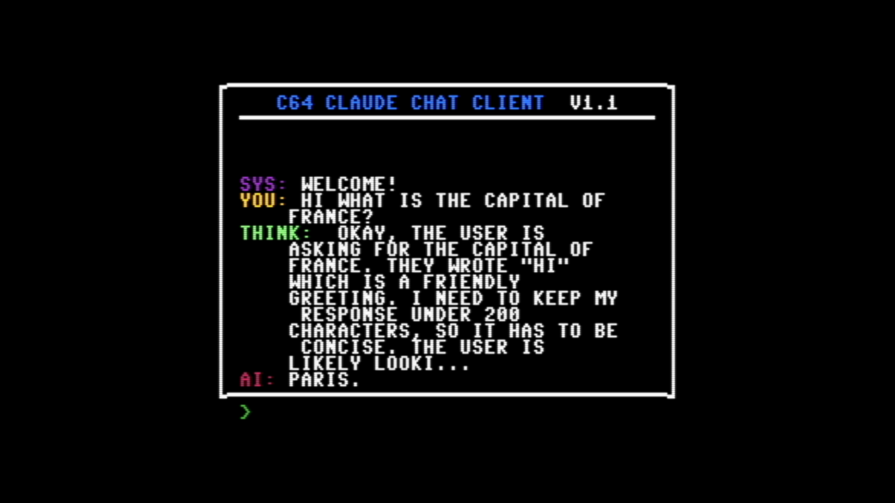
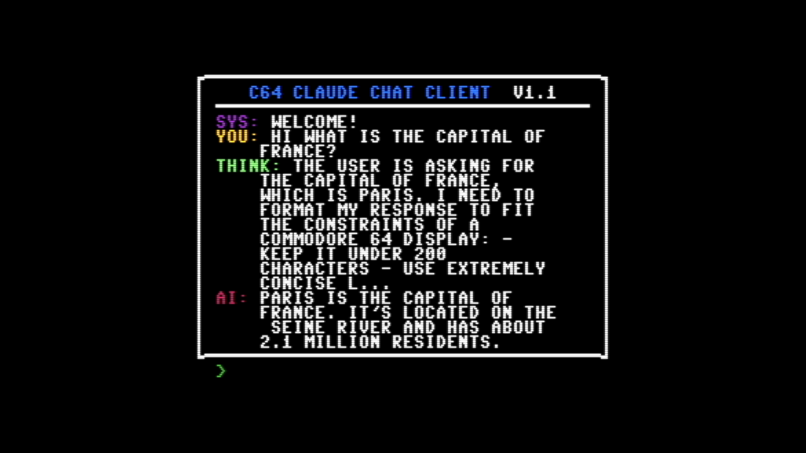

# C64ClaudeChat


Chat with Claude 3.7 Sonnet or llama.cpp AI models directly from a Commodore 64!

This project connects your C64 (running in VICE emulator) to either the Anthropic Claude API or a local llama.cpp server, allowing for an authentic retro computing experience with cutting-edge AI.


Now with full advanced reasoning <think> block support for both Claude and DeepSeek-R1:


## Overview

C64ClaudeChat creates a bridge between a C64 BASIC chat client and modern AI systems. The system uses VICE's binary monitor interface to directly read and write to C64 memory, allowing seamless communication between the 1980s computer and modern AI models.

## Features

- Full-featured chat UI on the C64
- Bidirectional communication with Claude 3.7 Sonnet or llama.cpp models
- Support for AI "thinking" output visualization
- Message chunking for longer conversations
- Word wrapping to fit the C64's 40-column display
- Colored messages for different participants (you/AI/system/thinking)
- Customize your C64 border color with the `/border` command
- Toggle thinking output with the `/think` command

## Requirements

- [VICE Emulator](https://vice-emu.sourceforge.io/) (tested with v3.9)
- Python 3.6+
- API access for one of:
  - Anthropic API key for Claude 3.7 Sonnet
  - Local llama.cpp server with compatible model

## Quick Start

1. **Set up access to your preferred AI model:**
   - For Claude: Set your Anthropic API key as an environment variable:
     ```
     export ANTHROPIC_API_KEY=your_api_key_here
     ```
   - For llama.cpp: Start your local llama.cpp server with a compatible model
     ```
     ./server --model models/DeepSeek-R1-Distill-Qwen-32B-Q6_K.gguf -c 4096 --host 127.0.0.1 --port 3000
     ```

2. **Start the VICE C64 emulator with the binary monitor enabled:**
   ```
   x64sc.exe -binarymonitor
   ```

3. **Start the appropriate Python bridge:**
   - For Claude:
     ```
     python c64claudebridge.py
     ```
   - For llama.cpp (with optional host and port arguments):
     ```
     python c64llamacppbridge.py [HOST] [PORT]
     ```
     The host defaults to 127.0.0.1 and port defaults to 3000 if not specified.

4. **Load the C64 chat client program:**
   - In VICE, go to File > Smart Attach
   - Select the `claudechat.prg` file 
   - Click "Autostart" button
   
   Alternatively:
   - Load the program with "Attach / Load"
   - Type `RUN` in the C64 console

5. **Start chatting with AI from your C64!**

## Supported Models

### Claude 3.7 Sonnet
- Requires an Anthropic API key
- Uses the official Claude API with thinking support

### llama.cpp Models
- Tested with DeepSeek-R1-Distill-Qwen-32B-Q6_K.gguf
- Other models may work but might require different message structures
- The llama.cpp bridge formats messages with `<｜User｜>` and `<｜Assistant｜>` tokens
- Models need to support `<think></think>` blocks for thinking feature

## Commands

In the Python bridge console:
- `/read`: Read any message from the C64
- `/clear`: Clear the incoming message buffer
- `/reset`: Reset the conversation
- `/quit`: Exit the chat client
- `/help`: Show help information

On the C64:
- `/border <color>`: Change the border color (options: black, white, red, cyan, purple, green, blue, yellow, orange, brown, light red, dark gray, medium gray, light green, light blue, light gray)
- `/think`: Toggle the display of thinking messages (on/off)
  - Note: This only controls visibility on the C64. The bridge still receives thinking output from the AI model. To completely disable thinking, you would need to modify the bridge code or adjust your llama.cpp configuration.

## Project Structure

- `claudechat.prg`: Compiled C64 program
- `claudechat.bas`: BASIC source code
- `c64claudebridge.py`: Python bridge between C64 and Claude API
- `c64llamacppbridge.py`: Python bridge between C64 and llama.cpp
- `vice_monitor.py`: VICE binary monitor interface
- `miniasm6502.py`: 6502 assembler/disassembler
- `psid.py`: SID format handler
- `petcat_format.md`: Guidelines for formatting C64 BASIC code

## Memory Locations

- `$C000 (49152)`: Incoming message buffer 
  - First byte: Length of message
  - Remaining bytes: ASCII characters of message
- `$C100 (49408)`: Outgoing message buffer
  - First byte: Length of message
  - Remaining bytes: ASCII characters of message
- `$C200 (49664)`: Message status byte
  - `0`: No message / message completed
  - `1`: Partial message chunk (more chunks coming)
  - `2`: Last chunk of message
- `$C300 (50176)`: Thinking message buffer
  - First byte: Length of message
  - Remaining bytes: ASCII characters of thinking output
- `$C400 (50432)`: Thinking status byte
  - `0`: No thinking message / thinking completed
  - `1`: Partial thinking chunk (more chunks coming)
  - `2`: Last chunk of thinking message

## Message Flow

1. **User input flow:**
   - C64 program captures user input
   - C64 program writes to outgoing buffer (`$C100`)
   - Python bridge reads from outgoing buffer
   - Python bridge sends message to AI (Claude or llama.cpp)

2. **AI response flow:**
   - Python bridge receives AI response
   - Bridge extracts thinking and response text
   - Bridge writes thinking to thinking buffer (`$C300`)
   - Bridge writes response to incoming buffer (`$C000`)
   - C64 program reads from both buffers and displays accordingly

3. **Chunking Protocol:**
   - Messages larger than 100 bytes are split into chunks
   - Status byte signals if current chunk is final (2) or has more following (1)
   - Each read/write operation clears buffer (sets length byte to 0)

## C64 BASIC Formatting

This project includes a comprehensive guide to formatting C64 BASIC code in the `petcat_format.md` file. Key considerations include:

- Character set differences (PETSCII vs ASCII)
- Case sensitivity reversal
- Control and color codes using CHR$()
- Screen and memory limitations
- BASIC keyword tokenization
- Program structure best practices

Refer to the guide when modifying the `.bas` file or creating new C64 BASIC programs.

## Limitations

- The C64 display is limited to 40 columns and 25 rows
- AI responses are limited to 200-240 characters
- Only ASCII characters are supported (converted to PETSCII)
- Thinking output may be truncated for display

## Further Enhancements

Step 1: Get it working in the VICE emulator. COMPLETE!

Step 2: Use a C64 Cartridge / Expansion Port Prototype Board (https://www.ebay.com/itm/273790354324) and an ESP32 to get messages in and out of memory on real hardware. (In Progress)

## License

This project is licensed under the MIT License - see the LICENSE file for details.

## Acknowledgments

- [pyvicemon](https://github.com/Galfodo/pyvicemon) for the VICE monitor interface
- [VICE Team](https://vice-emu.sourceforge.io/) for the C64 emulator
- [Anthropic](https://anthropic.com/) for Claude API
- [llama.cpp](https://github.com/ggerganov/llama.cpp) for local AI inference

## Author

- Mike Blakemore - [@mblakemore](https://github.com/mblakemore)