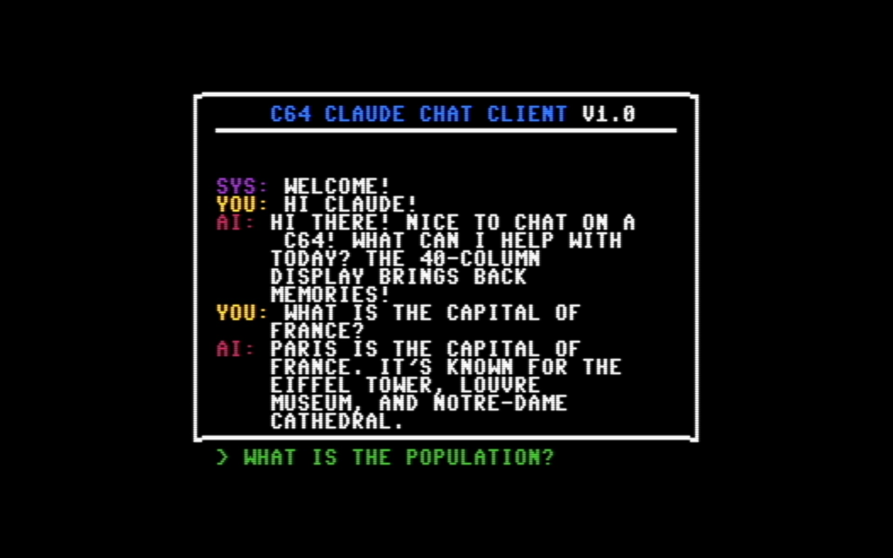
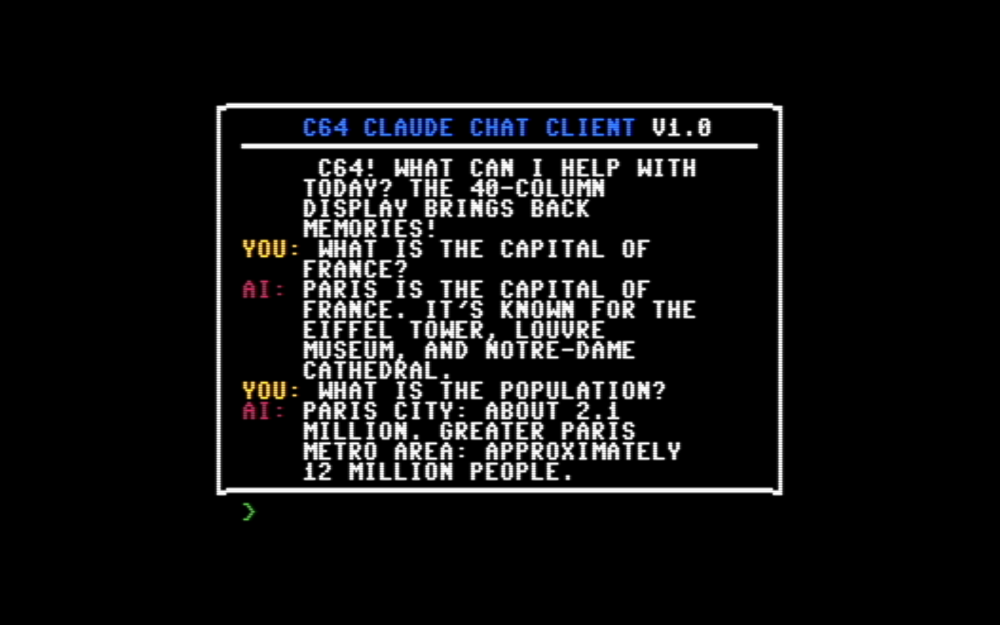

# C64ClaudeChat


Chat with Claude 3.7 Sonnet AI directly from a Commodore 64!

This project connects your C64 (running in VICE emulator) to the Anthropic Claude API, allowing for an authentic retro computing experience with cutting-edge AI.




## Overview

C64ClaudeChat creates a bridge between a C64 BASIC chat client and the Claude 3.7 Sonnet API. The system uses VICE's binary monitor interface to directly read and write to C64 memory, allowing seamless communication between the 1980s computer and modern AI.

## Features

- Full-featured chat UI on the C64
- Bidirectional communication with Claude 3.7 Sonnet
- Message chunking for longer conversations
- Word wrapping to fit the C64's 40-column display
- Colored messages for different participants (you/AI/system)
- Customize your C64 border color with the `/border` command

## Requirements

- [VICE Emulator](https://vice-emu.sourceforge.io/) (tested with v3.9)
- Python 3.6+
- Anthropic API key for Claude 3.7 Sonnet

## Quick Start

1. Set your Anthropic API key as an environment variable:
   ```
   export ANTHROPIC_API_KEY=your_api_key_here
   ```

2. Start the VICE C64 emulator with the binary monitor enabled:
   ```
   x64sc.exe -binarymonitor
   ```

3. Load the C64 chat client program:
   - In VICE, go to File > Smart Attach
   - Select the `claudechat.prg` file 
   - Click "Autostart" button
   
   Alternatively:
   - Load the program with "Attach / Load"
   - Type `RUN` in the C64 console

4. Start the Python bridge:
   ```
   python c64claudebridge.py
   ```

5. Start chatting with Claude from your C64!

## How It Works

The system consists of three main components:

1. **C64 Chat Client** (`claudechat.prg` / `claudechat.bas`): A BASIC program that provides the user interface on the C64, handles text input/output, and communicates through memory locations.

2. **Python Bridge** (`c64claudebridge.py`): Connects to both the VICE emulator and the Claude API, handling data transfer between the two systems.

3. **VICE Interface** (`vice_monitor.py`, `miniasm6502.py`, `psid.py`): Python libraries from [pyvicemon](https://github.com/Galfodo/pyvicemon) that communicate with VICE's binary monitor protocol.

### Memory Locations

The C64 and Python bridge communicate through specific memory locations:
- `$C000` (49152): Incoming messages (Python → C64)
- `$C100` (49408): Outgoing messages (C64 → Python)
- `$C200` (49664): Message status byte for chunking support

## Commands

In the Python bridge console:
- `/read`: Read any message from the C64
- `/clear`: Clear the incoming message buffer
- `/reset`: Reset the conversation with Claude
- `/quit`: Exit the chat client
- `/help`: Show help information

On the C64:
- `/border <color>`: Change the border color (options: black, white, red, cyan, purple, green, blue, yellow, orange, brown, light red, dark gray, medium gray, light green, light blue, light gray)

## Project Structure

- `claudechat.prg`: Compiled C64 program
- `claudechat.bas`: BASIC source code
- `c64claudebridge.py`: Python bridge between C64 and Claude API
- `vice_monitor.py`: VICE binary monitor interface
- `miniasm6502.py`: 6502 assembler/disassembler
- `psid.py`: SID format handler

## Limitations

- The C64 display is limited to 40 columns and 25 rows
- Claude's responses are limited to 200 characters
- Only ASCII characters are supported

## Memory Locations

  - `$C000 (49152)`: Incoming message buffer 
    - First byte: Length of message
    - Remaining bytes: ASCII characters of message
  - `$C100 (49408)`: Outgoing message buffer
    - First byte: Length of message
    - Remaining bytes: ASCII characters of message
  - `$C200 (49664)`: Message status byte
    - `0`: No message / message completed
    - `1`: Partial message chunk (more chunks coming)
    - `2`: Last chunk of message

## Message Flow
  - Python script writes to incoming buffer (`$C000`)
  - C64 program reads from incoming buffer
  - C64 program writes to outgoing buffer (`$C100`)
  - Python script reads from outgoing buffer
  - Status byte (`$C200`) coordinates multi-chunk message handling

## Chunking Protocol
  - Messages larger than 100 bytes are split into chunks
  - Status byte signals if current chunk is final (2) or has more following (1)
  - Each read/write operation clears buffer (sets length byte to 0)
  
## Further Enhancements

Step 1: Get it working in the VICE emulator. COMPLETE!

Step 2: Use a C64 Cartridge / Expansion Port Prototype Board (https://www.ebay.com/itm/273790354324) and an ESP32 to get messages in and out of memory on real hardware. (In Progress)

## License

This project is licensed under the MIT License - see the LICENSE file for details.

## Acknowledgments

- [pyvicemon](https://github.com/Galfodo/pyvicemon) for the VICE monitor interface
- [VICE Team](https://vice-emu.sourceforge.io/) for the C64 emulator
- [Anthropic](https://anthropic.com/) for Claude API

## Author

- Mike Blakemore - [@mblakemore](https://github.com/mblakemore)
